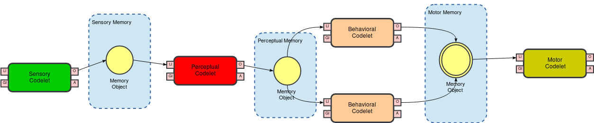

# Aula 15 - CST: Controlando o WorldServer3D

### Objetivo

O objetivo desta aula é estender o exemplo do ws3dapp, utilizando o CST, demonstrando sua proficiência no uso do toolkit.

### Atividade 1

Desenvolva um mecanismo para a busca de cristais e alimentos da seguinte forma: enquanto a energia estiver em mais de 40%, a criatura só deve coletar alimentos se os mesmos estiverem obstuíndo sua passagem. Nesse caso, a criatura deverá buscar as jóias necessárias para completar seu leaflet e trocar essas jóias por pontos. Caso a energia fique abaixo de 40%, ele deve prioritariamente buscar os alimentos mais próximos que conhecer, pegando jóias pelo caminho caso elas estejam obstruíndo a passagem da criatura. Para auxiliar no desenvolvimento dessa atividade, veja o [Subsumption Model Trail](http://cst.fee.unicamp.br/tutorials/SubsumptionModelTrail) no site do CST. Para ajudar na visualização da arquitetura, você pode utilizar a ferramenta [draw.io](http://www.draw.io/) e carregar o demo [CST-Diagram.xml](http://faculty.dca.fee.unicamp.br/gudwin/sites/faculty.dca.fee.unicamp.br.gudwin/files/ia941/CST-Diagram.xml). Ainda, no [draw.io](http://www.draw.io/), você pode carregar o [ECA-Library.xml](http://faculty.dca.fee.unicamp.br/gudwin/sites/faculty.dca.fee.unicamp.br.gudwin/files/ia941/ECA-Library.xml), a partir de File -> Open Library From ... que cria uma palheta com codelets, Memory Objects, Memory Containers e Memories de um modo geral. O resultado será um diagram mais ou menos como o seguinte:

### Atividade 2

Desenvolva uma versão equivalente à Atividade 3 da aula 13 (ou seja, detectar blocos do ambiente e desenvolver um caminho que evite a colisão com os blocos, para ir de um ponto a outro), agora utilizando o CST.