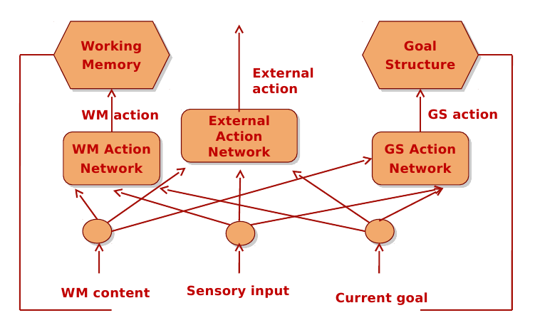

# Aula 9 - Clarion: Controlando o WorldServer3D

## Objetivo

O objetivo da aula de hoje é utilizar a arquitetura cognitiva Clarion para controlar uma criatura artificial no [WorldServer3D](http://faculty.dca.fee.unicamp.br/gudwin/sites/faculty.dca.fee.unicamp.br.gudwin/files/ia941/ws3d-bin.zip), de modo análogo ao que foi feito com o SOAR. Para tanto, é necessário que entendamos o funcionamento do Clarion, e desenvolvamos uma instância da arquitetura Clarion para controlar a criatura.

## Atividade

A proposta desta atividade é desenvolver um sistema de controle (uma mente artificial) para a criatura do WorldServer3D, utilizando o Clarion. Nosso desafio será semelhante ao desafio que foi proposto na implementação com o SOAR. A criatura deve obter sua meta de aquisição de jóias a partir de seu "leaflet", e trocar por pontos, de modo análogo ao que foi feito no caso do SOAR. Para testar a capacidade da criatura, dois testes são propostos:

+ **Teste 1**: A criatura deve buscar todas as jóias designadas em seu leaflet, trocar por pontos e deve parar depois disso.
+ **Teste 2**: Duas criaturas devem competir para buscar as jóias que lhes foram delegadas e trocar por pontos. A primeira delas será a criatura com o controlador deliberativo desenvolvido em SOAR na aula 6. A segunda será a criatura com o controlador usando o Clarion.

Após a entrega, cada aluno deverá providenciar uma demonstração de seu código, o que poderá ser feito na próxima aula depois da entrega, ou em outro horário, combinado com o professor. Peço que me disponibilizem on-line um arquivo ZIP contendo:

+ Os executáveis do controlador, distribuídos de tal forma a executar um script bash e disparar tudo que é necessário para a aplicação rodar (o código deve incluir também o próprio ws3d).
+ A árvore de código fonte necessária à recompilação do controlador, e investigação do código caso seja necessário.

Além disso, durante a demonstração, o aluno deve estar preparado para explicar a lógica da solução, uma vez que diferentes estratégias podem ser usadas.

## Dicas para a Implementação

Antes de mais nada, é preciso dizer que vocês têm toda a liberdade para utilizar quaisquer estruturas disponíveis no Clarion para concluir a atividade. É importante mencionar que no Clarion, pelo fato dele ser um toolkit e não um framework como o Soar, diferentes estratégias podem ser utilizadas para compor a solução. A estratégia mais simples é usar regras fixas reativas, de modo análogo ao controlador reativo do Soar. Essa é a maneira fácil e sem graça de fazer o controlador funcionar no Clarion, mas não permite que vocês explorem todas as potencialidades da arquitetura. Outras estratégias mais interessantes podem ser desenvolvidas, por exemplo, usando o sistema motivacional do Clarion, ou usando algum tipo de aprendizado. Lembre-se, vale a pena tentar explorar um pouco o toolkit, pois caso tudo dê errado, sempre será possível criar uma solução reativa, que funcionará sem muitas dificuldades. Vale a pena tentar explorar um pouco os recursos do Clarion, até mesmo para conhecer melhor suas potencialidades de uso. Para começar a pensar em uma solução, vamos relembrar algumas questões importantes sobre o Clarion. Em primeiro lugar, observemos a figura abaixo, que mostra como uma aplicação típica do Clarion funciona.



Observem que o "sensory input" corresponde a um ou mais DimensionValuePair, que podem conter informações genéricas. Existe no framework do Clarion, a classe SensoryInput, que deve ser utilizada para criar-se um objeto que funcionará como "sensory input". Essa classe possui o método Add, por meio do qual diversos DimensionValuePair podem ser inseridos, compondo a informação sensorial.

Na saída, devem ser criados diversos objetos da classe ```ExternalActionChunk```, um para cada possível ação de saída que o Clarion pode gerar, controlando a criatura.

O ciclo cognitivo básico do Clarion, envolve a seguinte sequência:

``` C#
Agent.Perceive(si);
ExternalActionChunk chosen = Agent.GetChosenExternalAction(si);
```

onde si é um objeto do tipo ```SensoryInput```, devidamente preenchido com a informação sensorial.

Depois que as entradas do controlador foram definidas, e também as ações possíveis, é necessário agora criar as estruturas internas do ACS, que podem ser tanto no bottom-level (uma rede neural), como no top-level (regras).

Caso optem por explorar o sistema motivacional, um dos grandes atrativos do Clarion, utilizaremos a Goal Structure e o mecanismo de drives do Clarion. Vejam os detalhes no manual do Clarion. 

Um exemplo (demo) bastante singelo de como usar o Clarion para controlar uma criatura no WorldServer3D pode ser visto [aqui](http://faculty.dca.fee.unicamp.br/gudwin/sites/faculty.dca.fee.unicamp.br.gudwin/files/ia941/DemoClarion-v0.8.zip). Neste demo, duas regras fixas são utilizadas pelo Clarion para fazer a criatura desviar de obstáculos, virando à direita.