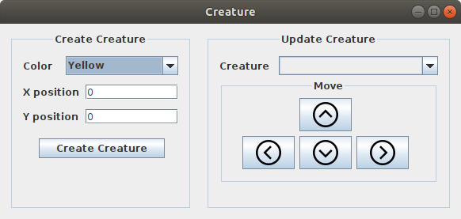
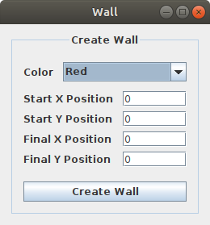

# Entrega Aula 1

### Sobre

Esse pequeno software tem por objetivo controlar o WS3D tornando possivel a criação de objetos, bem como ter o controle deles

---
## Telas

### WS3D Com objetos Criados pelo Contolador

### Principal

### Criatura

### Comida

### Joia

### Parede

